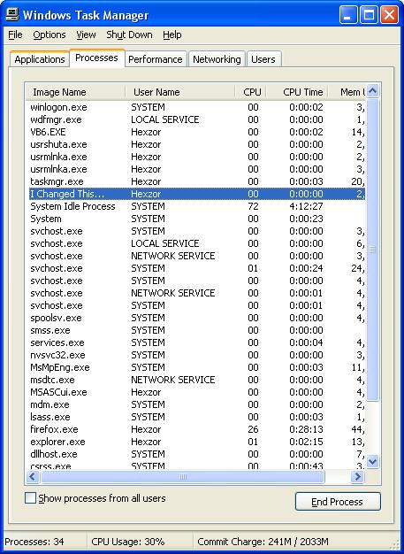



## Change your Process name in Windows Task Manager\!

### Description

An alternative method to hide your process from Windows Task Manager. Ive had the idea to do this for many years, but i couldnt get past the GPF's with sendmessage. recently i figured out how to make it work. Screenshot included.
 
### More Info
 
Compile before you run it...

             |
---                |---
**Submitted On**   |2006-09-02 18:00:12
**By**             |[Billy Conner](https://github.com/Planet-Source-Code/PSCIndex/blob/master/ByAuthor/billy-conner.md)
**Level**          |Advanced
**User Rating**    |4.0 (8 globes from 2 users)
**Compatibility**  |VB 6\.0
**Category**       |[Miscellaneous](https://github.com/Planet-Source-Code/PSCIndex/blob/master/ByCategory/miscellaneous__1-1.md)
**World**          |[Visual Basic](https://github.com/Planet-Source-Code/PSCIndex/blob/master/ByWorld/visual-basic.md)
**Archive File**   |[Change\_you201737922006\.zip](https://github.com/Planet-Source-Code/billy-conner-change-your-process-name-in-windows-task-manager__1-66443/archive/master.zip)

### API Declarations

Many..see code

